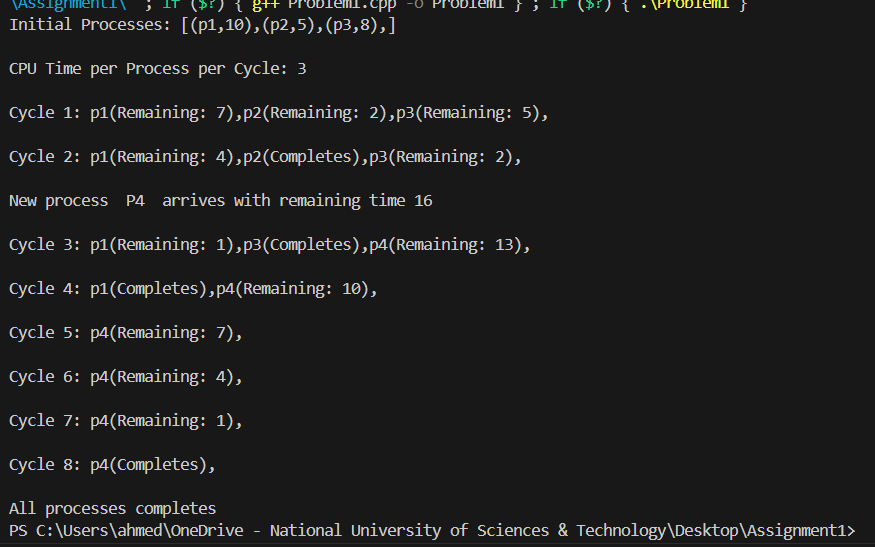

# Assignment1
assignment one of data structures and algorithm

## Approach

#### problem 1
 I have create nodes of circular linked list which represents cpu processes and then add some cpu processes to circular linked list and assigns some fixed cpu time to each cpu process .And according to it the remaining time decreases and when it completes its execution time it is removed from circular linked list.And Also some new process occurs randomly in any cycle.

#### problem 2

In this I have used single linked list in which nodes represents the 64-bit integer and I am generating randomly 64-bit integer and inserting in linked list.Then for primality test i am using trial division method in which i have taken smaller primes between 1 and 500 and check wheather the 1024 bit number is divisible by these smaller primes

 ## Assumptions

 No assumptions in Problem 1 and 2

 ## Github link

 [github link](https://github.com/ahmedmabood/Assignment1.git)

 ## Challenges
 #### problem 1

 it was creating issues when  remaining time of first process becomes less than 0 and it  deletes the first process but it was not updating the processes alongside with it .So then I have made delete process function which resolves issue .
 #### problem 2
 if the 1024 bit number is divisible by smaller prime which is greater than 500 then test fails but most of the times it produces correct results
 ## Screenshot

 #### problem 1

 

 #### problem 2

 